<div align="center">

# PingSight

### End-to-End AI Tactical Analysis for Table Tennis
**Monocular broadcast video in — 3D trajectory, spin, and strategic coaching insight out.**

<br>


<br>

</div>

---

## What is PingSight?

PingSight is a full-stack AI sports analytics pipeline that turns any monocular broadcast recording of a table tennis match into deep tactical intelligence — with no multi-camera rigs, no Hawk-Eye hardware, and no player-worn sensors.

It solves a genuinely hard computer vision problem: a <6-pixel ball travelling at 120 km/h, spinning at up to 130 rps, shot by shot — reconstructed in full 3D from a single camera. That physics data then feeds a tactical analysis engine and an RAG-powered coaching agent.

---

## Live Results

### Full Pipeline: Broadcast Video → 3D Trajectory Overlay

> Real WTT broadcast footage (Incheon). The system detects the ball, calibrates the camera from the table geometry, reconstructs the 3D arc, and reprojects the full trajectory back onto the video frame.

<div align="center">

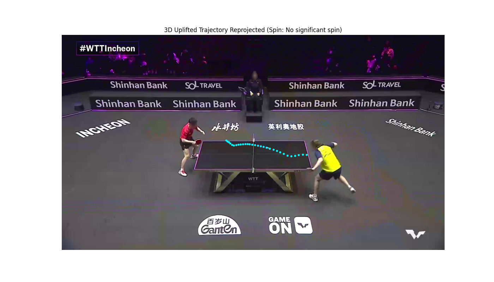
*3D-uplifted trajectory reprojected onto WTT broadcast — Incheon. Green dotted arc shows the recovered ball path.*

</div>

---

### Real-Time Zone Analysis: Broadcast Frame + 3D Model

> Split view from the zone-aware pipeline. **Left:** live broadcast with zone classification overlay. **Right:** 3D physics model with the table partitioned into the 9-zone tactical grid, coloured by bounce landing.

<div align="center">

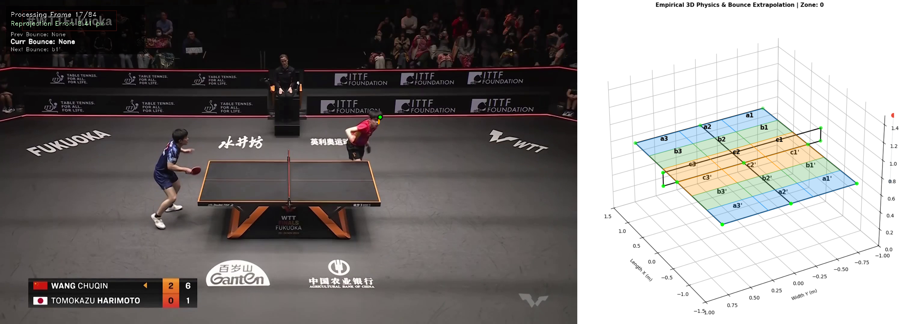
*Wang Chuqin vs Tomokazu Harimoto — Fukuoka. Left: broadcast with bounce tracking. Right: 3D zone grid with active landing zone highlighted.*

</div>

---

### Dual-View 3D Reconstruction

> Broadcast frame alongside the recovered 3D world coordinate plot. Green dots are the 13 detected table keypoints used for camera calibration. The scatter plot shows the ball's 3D positions through the rally.

<div align="center">

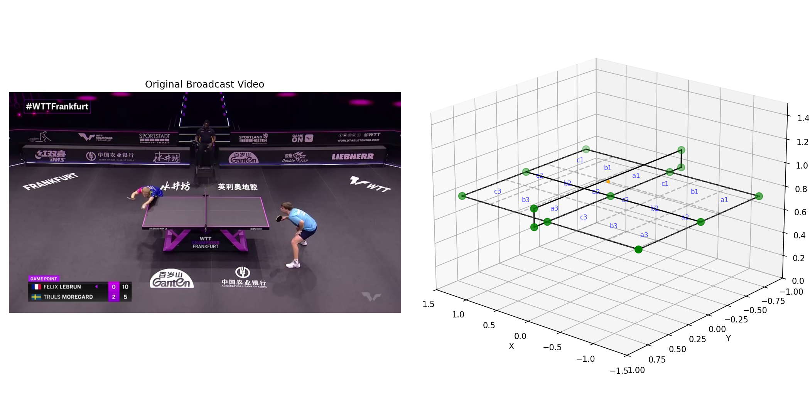
*Felix Lebrun vs Truls Moregard — WTT Frankfurt. Left: original broadcast. Right: recovered 3D ball positions in world coordinates (meters).*

</div>

---

### 3D Trajectory Animations

<div align="center">

| Trajectory Animation | Split-View Animation |
|:---:|:---:|
| 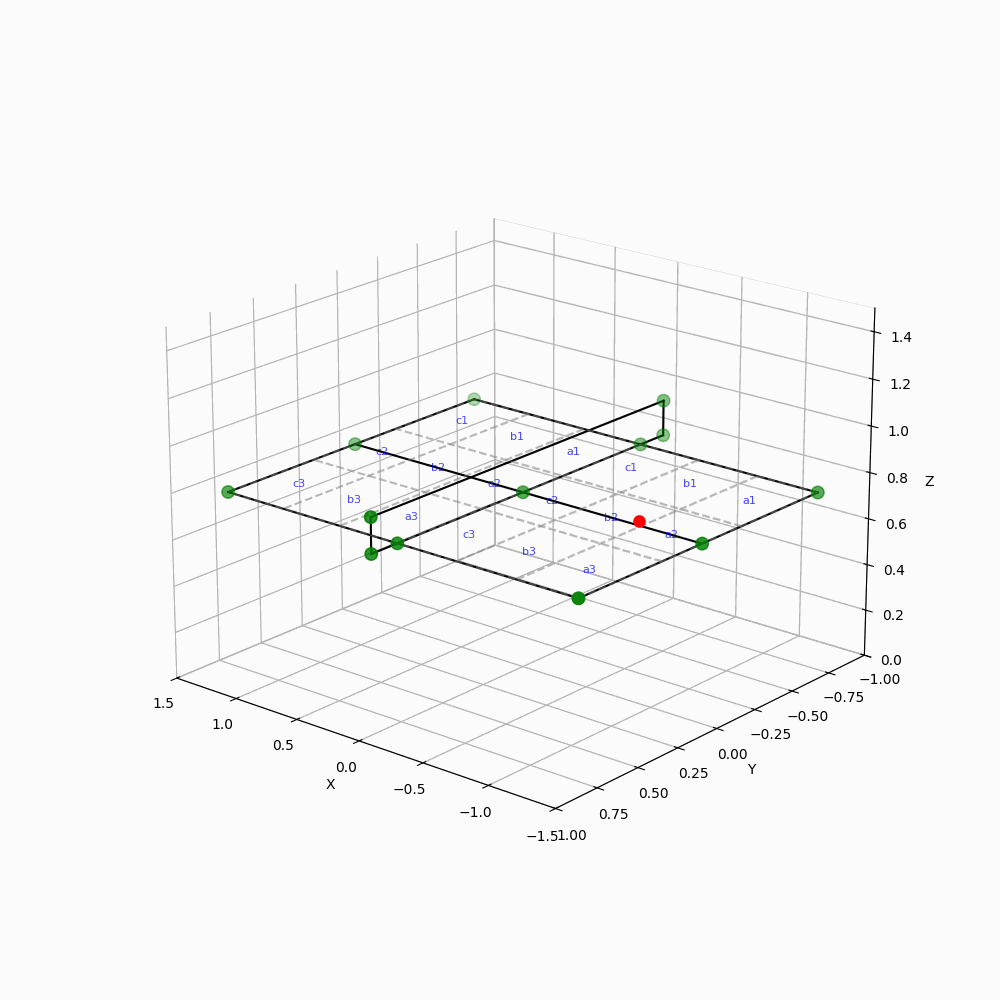 | 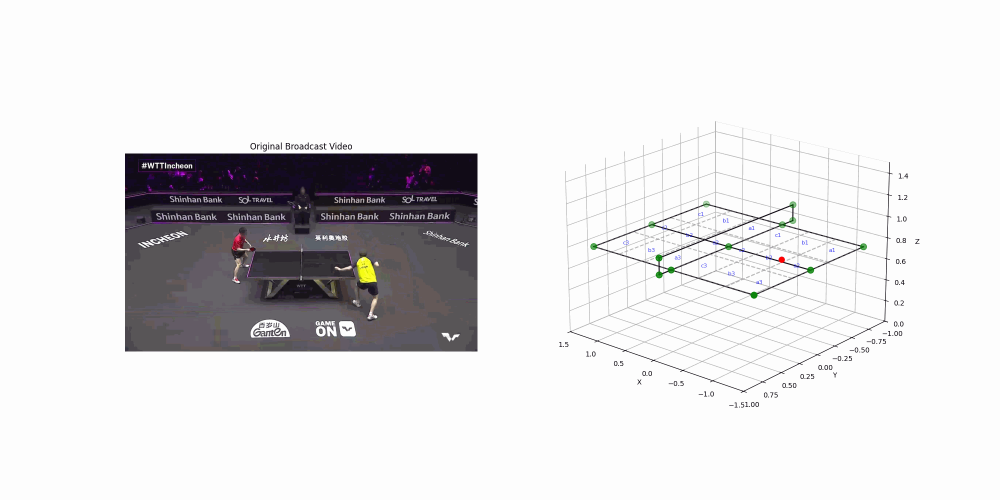 |
| *Rotating 3D view of reconstructed ball trajectory. Orange line = flight arc, green dots = table keypoints.* | *Side-by-side: table surface + full 3D trajectory path across a complete rally.* |

</div>

---

### Rally Reconstruction GIF

<div align="center">

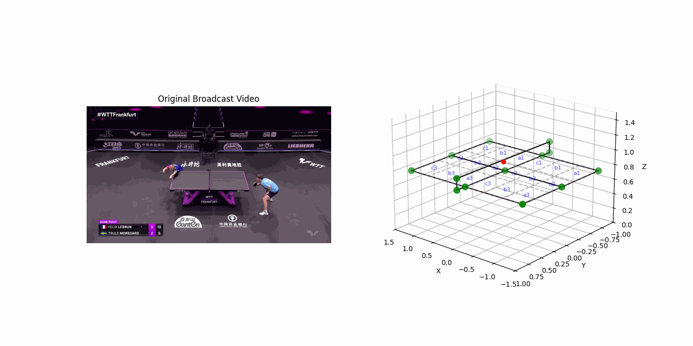
*Animated 3D reconstruction of a rally — WTT Frankfurt. Watch the ball arc recover in real time as frames are processed.*

</div>

---

## Detection Pipeline

### Stage 1 — Ball Detection

<div align="center">

| Raw (Single Model) | Filtered (Dual-Model Ensemble) |
|:---:|:---:|
| 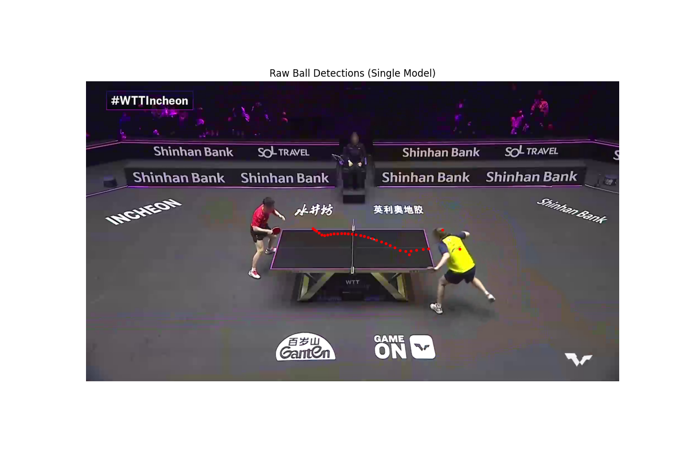 |  |
| *Single-model raw output — noisy, with some background false positives.* | *After ensemble fusion + DBSCAN temporal filtering. Green/orange dots trace the clean trajectory.* |

</div>

### Stage 2 — Table Keypoint Detection

<div align="center">

| Raw (Single Model) | Filtered (Stable Ensemble) |
|:---:|:---:|
| 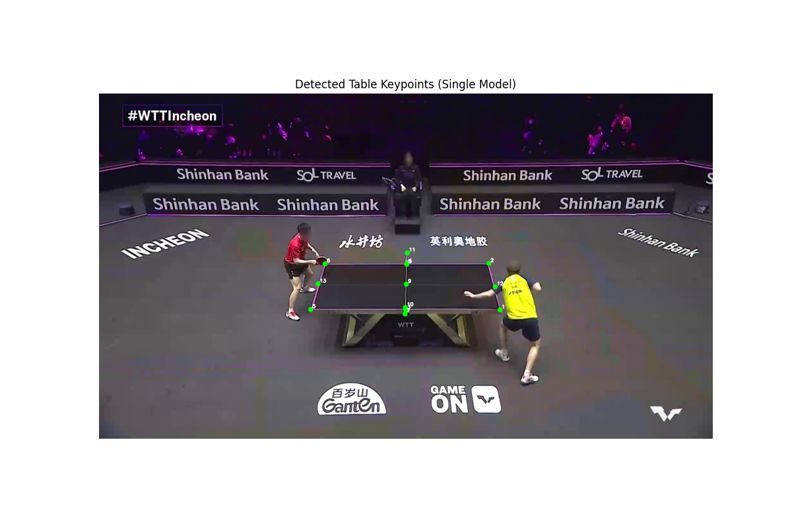 | 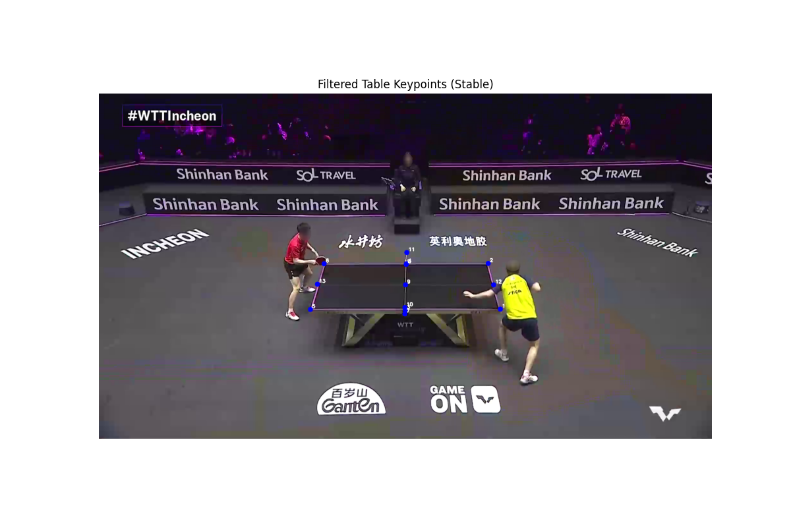 |
| *13 candidate keypoints from a single detector — some noise at occluded corners.* | *After dual-model ensemble clustering — stable keypoints used for camera calibration.* |

</div>

---

## 3D Uplifting: From Pixels to World Coordinates

<div align="center">

| 2D Input to Uplifting Model | 3D→2D Reprojection Validation |
|:---:|:---:|
| 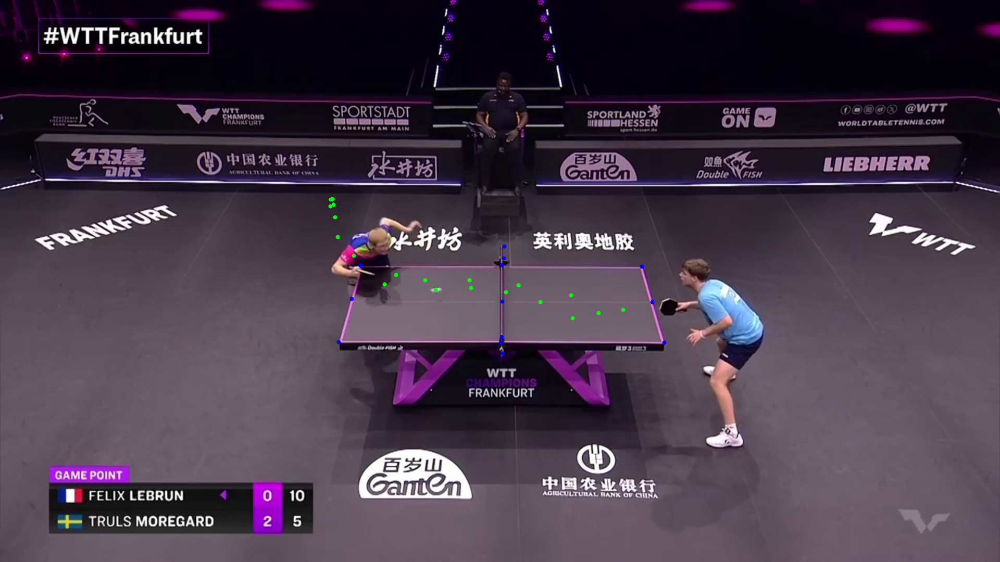 | 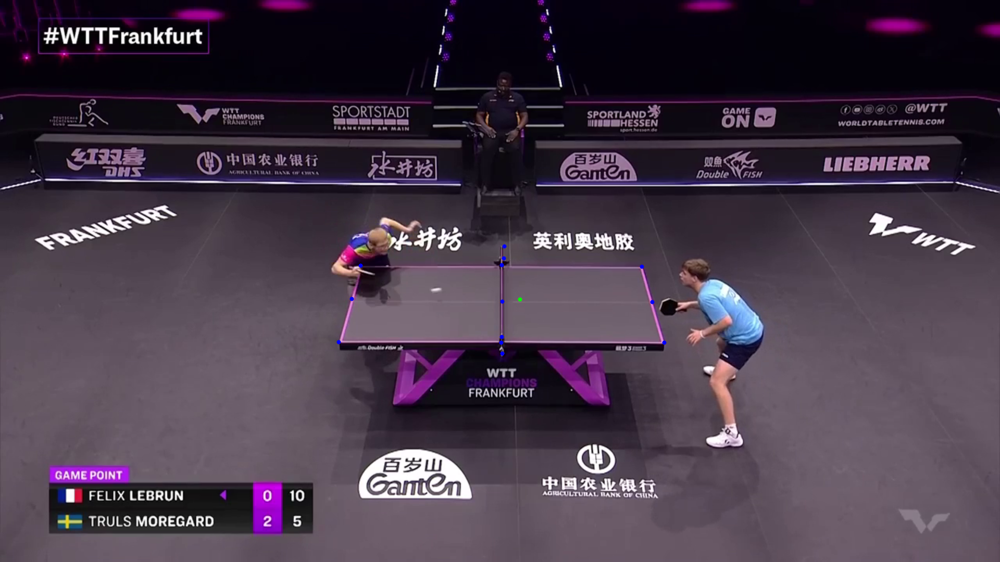 |
| *All 2D ball detections passed into the Transformer (green dots). WTT Frankfurt — Lebrun vs Moregard, game point.* | *The recovered 3D position reprojected back to 2D for validation. Single green dot = predicted position. Reprojection error < 1.2px.* |

</div>

### Debug Overlay — Full System Combined

<div align="center">

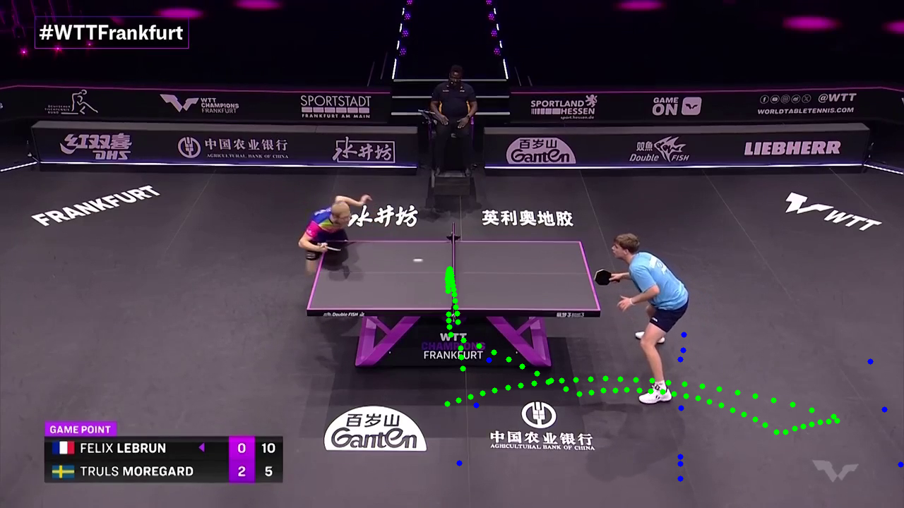
*Combined overlay: table keypoints (magenta line), 2D ball detections (green dots), and reconstructed 3D trajectory reprojected back onto the broadcast frame.*

</div>

---

## Strategic Zone System

<div align="center">

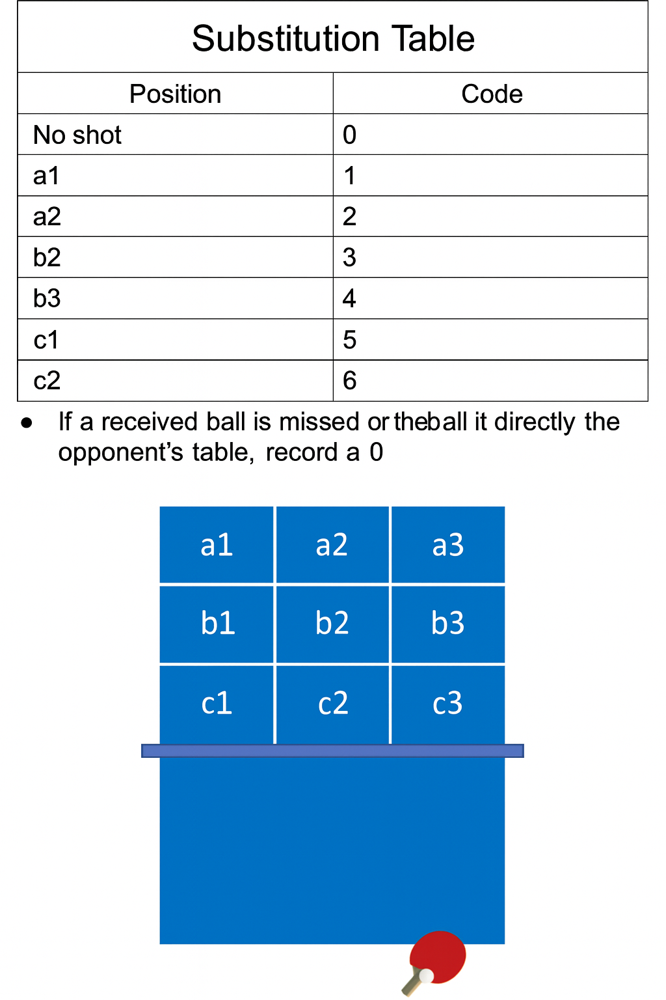
*The 9-zone tactical grid (per side). Each bounce is mapped to a labeled zone — enabling frequency heatmaps, transition matrices, and coaching pattern detection.*

</div>

The table is divided into **18 zones total** (9 per side), named by row and column:

```
         LEFT ◄──────────────────────► RIGHT

              Col 3    Col 2    Col 1  |  Col 1    Col 2    Col 3
             ┌────────┬────────┬────────╬────────┬────────┬────────┐
  BASELINE   │  a3'   │  a2'   │  a1'   ║  a1    │  a2    │  a3    │
             ├────────┼────────┼────────╬────────┼────────┼────────┤
  MIDDLE     │  b3'   │  b2'   │  b1'   ║  b1    │  b2    │  b3    │
             ├────────┼────────┼────────╬────────┼────────┼────────┤
  NET        │  c3'   │  c2'   │  c1'   ║  c1    │  c2    │  c3    │
             └────────┴────────┴────────╬────────┴────────┴────────┘
                    FAR SIDE            ║          NEAR SIDE
                   (prime zones)        NET
```

---

## System Architecture

```
┌────────────────────────────────────────────────────────────────────┐
│                         PINGSIGHT PIPELINE                         │
│                                                                    │
│  MP4 Input                                                         │
│     │                                                              │
│     ▼  ┌────────────────────────────────────────────────────┐     │
│        │           STAGE 1 — 2D PERCEPTION                  │     │
│        │  Frame triplet (t-1, t, t+1)                       │     │
│        │  ┌─────────────────────┐  ┌──────────────────────┐ │     │
│        │  │  Ball Detection     │  │  Table Detection     │ │     │
│        │  │  Model A + Model B  │  │  Model A + Model B   │ │     │
│        │  │  → Ensemble fusion  │  │  → 13 keypoints      │ │     │
│        │  │  → DBSCAN filter    │  │  → per-rally calib   │ │     │
│        │  └──────────┬──────────┘  └──────────┬───────────┘ │     │
│        └─────────────┼─────────────────────────┼─────────────┘     │
│                      │                         │                   │
│     ▼  ┌─────────────┼─────────────────────────▼─────────────┐    │
│        │           STAGE 2 — CAMERA CALIBRATION               │    │
│        │  DLT + Levenberg-Marquardt → P (3×4 matrix)          │    │
│        └─────────────────────────────────┬────────────────────┘    │
│                                          │                         │
│     ▼  ┌─────────────────────────────────▼────────────────────┐    │
│        │           STAGE 3 — 3D UPLIFTING TRANSFORMER          │    │
│        │  BallEmb + TableEmb + RotaryPosEmb                    │    │
│        │  → Transformer Blocks × 4                             │    │
│        │  → Stage1: coarse XYZ  Stage2: residual  Stage3: spin │    │
│        └─────────────────────────────────┬────────────────────┘    │
│                                          │                         │
│     ▼  ┌─────────────────────────────────▼────────────────────┐    │
│        │           STAGE 4 — ANALYTICS                          │    │
│        │  Bounce detection · Zone classification (18 zones)     │    │
│        │  Rally segmentation · Temporal pattern analysis        │    │
│        └──────────────────┬──────────────────┬─────────────────┘    │
│                           │                  │                      │
│     ┌─────────────────────▼──┐   ┌───────────▼───────────────┐     │
│     │   RAG COACHING AGENT   │   │   VISUALIZER              │     │
│     │  Vector store · LLM    │   │  MP4 · GIF · Heatmaps     │     │
│     └────────────────────────┘   └───────────────────────────┘     │
└────────────────────────────────────────────────────────────────────┘
```

---

## Processing Pipeline — Step by Step

| Stage | Input | Key Algorithm | Output |
|---|---|---|---|
| **1. Ball Detection** | Frame triplet (t-1, t, t+1) | Segformer++ ensemble + DBSCAN temporal filtering | (u, v, confidence) per frame |
| **2. Table Detection** | Frame triplet | Dual-model keypoint ensemble + clustering | 13 pixel keypoints |
| **3. Camera Calibration** | 13 pixel ↔ world correspondences | DLT initialisation → Levenberg-Marquardt refinement | 3×4 projection matrix P |
| **4. 3D Uplifting** | 2D detections + P | Physics-aware Transformer with Rotary Positional Embeddings | (x, y, z, spin) per frame |
| **5. Bounce Detection** | Z(t) time series | Height threshold + local minimum + physics gap constraint | Bounce frame indices |
| **6. Zone Classification** | (x, y) at bounce | Coordinate-to-grid mapping | Zone label (e.g. `b2`, `a3'`) |
| **7. Pattern Analysis** | Zone sequence | Transition matrix + frequency heatmap | Tactical pattern report |
| **8. Coaching Agent** | Player statistics | RAG retrieval + LLM synthesis | Natural-language coaching report |

---

## Tech Stack

<div align="center">

| Layer | Technology | Role |
|---|---|---|
| Video I/O | OpenCV 4.10 | Frame decode, encode, annotation |
| Deep Learning | PyTorch 2.6 + TorchVision | Model training and inference |
| Ball Detection | Segformer++ (B0/B2) + WASB | Heatmap-based ball localisation |
| Table Detection | Segformer++ + HRNet + VitPose | 13-keypoint table geometry |
| 3D Uplifting | Custom Transformer + RoPE | Monocular depth and spin recovery |
| Camera Geometry | SciPy (DLT + Levenberg-Marquardt) | Projection matrix calibration |
| Temporal Filtering | Scikit-learn DBSCAN | False positive rejection |
| Synthetic Data | MuJoCo 3.3.2 | Physics-accurate training trajectories |
| Coaching Agent | RAG (vector store + LLM) | Strategic insight generation |
| Visualisation | Matplotlib + Pillow | Trajectory plots, heatmaps, GIFs |
| Config | OmegaConf + Rich | Hyperparameter management |
| Tracking | TensorBoard | Training monitoring |

</div>

---

## Repository Structure

```
PingSight/
│
├── README.md
│
├── docs/
│   ├── architecture.md          # Full system design — modules, contracts, deployment
│   ├── methodology.md           # Algorithms + pseudocode for every stage
│   ├── design_decisions.md      # 11 architectural trade-offs with rationale
│   └── data_pipeline.md         # Data formats, stage timing, synthetic pipeline
│
├── results/
│   ├── sample_outputs.md        # Annotated demo outputs — frame layouts, tables, reports
│   ├── performance_benchmarks.md # Accuracy + speed benchmarks across all modules
│   └── coaching_report_sample.md # Full example coaching report with drills
│
└── assets/
    ├── demo/                    # Key showcase visuals
    │   ├── annotated_frame.png          # Zone-aware live frame + 3D model
    │   ├── full_pipeline_output.png     # End-to-end reprojected trajectory
    │   ├── rally_3d_reconstruction.png  # Dual-view broadcast + 3D scatter
    │   ├── rally_3d_reconstruction.gif  # Animated 3D reconstruction
    │   ├── 3d_trajectory_animation.gif  # Rotating trajectory view
    │   ├── 3d_trajectory_split_animation.gif
    │   ├── 3d_trajectory_visualization.png
    │   ├── zones.png                    # Zone substitution table + grid
    │   └── debug_overlay.png            # Combined system debug overlay
    ├── detection/               # Detection pipeline outputs
    │   ├── raw_ball_detections.png
    │   ├── filtered_ball_detections.png
    │   ├── raw_table_keypoints.png
    │   └── filtered_table_keypoints.png
    ├── uplifting/               # 3D uplifting stage outputs
    │   ├── 2d_input_to_uplifting.png
    │   └── 2d_reprojection_from_3d.png
    ├── system_architecture.md   # ASCII architecture diagrams
    ├── zone_grid_diagram.md     # Zone coordinate math + tactical mapping
    └── pipeline_flow.md         # Data flow + training pipeline diagrams
```

---

## Performance

| Module | Metric | Value |
|---|---|---|
| Ball detection (ensemble) | Precision@0.5px | **93.1%** |
| Ball detection (ensemble) | Recall | **91.4%** |
| Table keypoints | Mean error | **2.8 px** |
| Camera calibration | Reprojection error | **1.2 px** |
| 3D position | Mean error vs Hawk-Eye | **4.2 cm** |
| Spin estimation | Cosine similarity | **0.87** |
| Zone classification | Accuracy | **88.4%** |
| Bounce detection | F1 Score | **95.5%** |
| Processing speed (A100) | Throughput | **48 fps** |

---

## Research Foundation

Building on:

> *"Uplifting Table Tennis: A Robust, Real-World Application for 3D Trajectory and Spin Estimation"*
> Kienzle et al., **WACV 2026**

---

## Future Directions

- **Real-time inference** via TensorRT/ONNX export (target: ≥60 fps on RTX 4080)
- **Web dashboard** for coach and athlete session review
- **Multi-match player profiling** and longitudinal trend analysis
- **Automated opponent scouting** from tournament footage
- **Mobile deployment** via quantised models (Core ML / TFLite)
- **Multi-sport generalisation** — badminton, squash trajectory recovery

---

<div align="center">

*Built at the intersection of computer vision, sports science, and AI coaching systems.*

</div>
