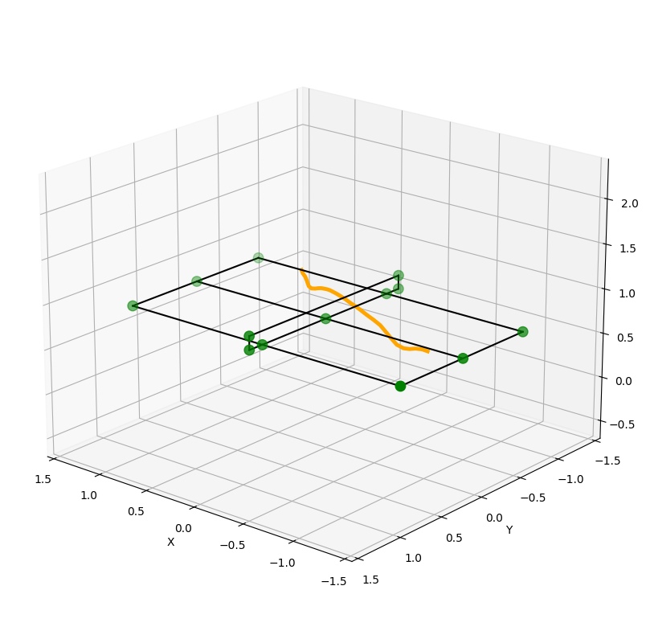

# Methodology — PingSight

> **Visual Reference:** All output images referenced here are in [`assets/`](../assets/). Pseudocode is abstract — no implementation code from source repositories is reproduced.

## 1. Philosophy

The system is built around three core principles:

1. **Physics First** — Every algorithmic decision is grounded in table tennis physics. The ball obeys gravity. It bounces predictably. Its height at the table surface is known. These constraints are encoded as hard priors, not learned heuristics.

2. **Uncertainty is Signal** — When a detector is uncertain, that uncertainty carries information (occlusion, motion blur, crowd interference). Rather than ignoring low-confidence detections, the system uses them probabilistically in ensemble fusion.

3. **Temporal Context is Everything** — Table tennis is a continuous physical process. A ball position at frame t is heavily constrained by its positions at t-1 and t+1. Every module exploits this.

---

## 2. Ball Detection

### 2.1 Problem Framing

Detecting a ≤6-pixel object in 1920×1080 frames with motion blur is not a standard object detection problem. The ball has:
- No stable texture
- Extreme velocity-induced blur (becomes elliptical at >80 km/h)
- Near-identical appearance to audience heads and ceiling lights

This is framed as a **semantic segmentation problem** rather than bounding-box detection — the model predicts a probability heatmap over the entire image, and the ball center is recovered as the heatmap peak.

### 2.2 Temporal Triplet Input

```pseudocode
function detect_ball(frame_prev, frame_curr, frame_next):
    input_tensor = stack([frame_prev, frame_curr, frame_next], dim=channel)
    heatmap = model_A.forward(input_tensor)        # primary
    heatmap_aux = model_B.forward(input_tensor)    # auxiliary

    combined = weighted_fusion(heatmap, heatmap_aux)
    peak = argmax(combined)
    confidence = combined[peak]

    if confidence < THRESHOLD:
        return None   # no detection this frame
    return (peak.u, peak.v, confidence)
```

The prev/next frames allow the model to disambiguate blur direction (indicating velocity) and suppress static false positives.

**Visual — raw vs filtered ball detections:**

| Before filtering | After filtering |
|:---:|:---:|
|  |  |

### 2.3 Temporal Filtering with DBSCAN

A single frame's detection can be noisy. DBSCAN over a sliding window of W frames clusters consistent detections:

```pseudocode
function filter_detections(detections_window):
    # detections_window: List of (frame_id, u, v, confidence)
    # Treat (frame_id, u, v) as a 3D point

    clusters = DBSCAN(detections_window, eps=SPATIAL_EPS, min_samples=3)

    for cluster in clusters:
        yield weighted_centroid(cluster)  # confidence-weighted average
```

This rejects isolated false positives while preserving the continuous trajectory.

---

## 3. Table Detection and Camera Calibration

### 3.1 13-Keypoint Table Model

The table has a precise, known geometry in world coordinates (2.74m × 1.525m). Detecting 13 canonical points (corners, midpoints, net endpoints) creates an over-determined correspondence problem.

```pseudocode
WORLD_KEYPOINTS = [
    (0, 0, 0.76),           # near left corner
    (1.37, 0, 0.76),        # near center
    (2.74, 0, 0.76),        # near right corner
    ...                      # 13 total
]

function detect_table(frame_prev, frame_curr, frame_next):
    kp_A = detector_A.forward(triplet)   # primary model
    kp_B = detector_B.forward(triplet)   # auxiliary model
    kp_merged = cluster_and_select(kp_A, kp_B)  # best hypothesis per point
    return kp_merged  # 13 pixel coordinates
```

**Visual — raw vs stable table keypoints:**

| Single-model (raw) | Ensemble-filtered (stable) |
|:---:|:---:|
|  |  |

### 3.2 Camera Calibration via DLT + LM

Given N ≥ 4 world↔pixel correspondences, the Direct Linear Transform computes a linear initial estimate of the projection matrix P, which is then refined with Levenberg-Marquardt:

```pseudocode
function calibrate_camera(pixel_kp, world_kp):
    # DLT: solve Ap = 0 via SVD
    A = build_dlt_matrix(pixel_kp, world_kp)
    P_init = svd_null_space(A)

    # LM refinement: minimize reprojection error
    def reprojection_error(P):
        projected = P @ homogeneous(world_kp)
        projected /= projected[2]
        return norm(projected[:2] - pixel_kp)

    P_refined = levenberg_marquardt(reprojection_error, P_init)
    return P_refined
```

Dynamic camera handling: calibration is re-run per rally segment (≈every 2–5 seconds) to handle broadcast camera movement.

---

## 4. 3D Uplifting

### 4.1 The Depth Ambiguity Problem

A single 2D point (u, v) lies on a 3D ray from the camera center. Without stereo vision, there are infinitely many 3D points that project to the same 2D pixel. The system resolves this using:

1. **Physics priors**: The ball must travel under gravity → its Z(t) follows parabolic physics
2. **Table constraint**: At bounce events, Z = TABLE_H (known)
3. **Trajectory continuity**: Position is smooth; velocity changes are bounded by physics
4. **Learned depth model**: Transformer trained on thousands of real rallies to internalize these priors

### 4.2 Rotary Positional Embeddings

Standard transformers use absolute positional encodings that don't generalize across different sequence lengths. Rotary Positional Embeddings encode the **relative** time offset between two frames as a rotation in attention space:

```pseudocode
function rotary_embed(query, key, timestep):
    # Encode time t as rotation angle θ(t) = t / MAX_FPS
    # For each attention head dimension pair (d_{2i}, d_{2i+1}):
    theta = timestep / MAX_FPS
    cos_t = cos(theta * frequency_i)
    sin_t = sin(theta * frequency_i)

    query_rotated = rotate(query, cos_t, sin_t)
    key_rotated   = rotate(key,   cos_t, sin_t)

    # Attention score now depends on (t_query - t_key), not absolute positions
    return dot(query_rotated, key_rotated)
```

This allows the model to generalize across rally lengths without position-specific overfitting.

**Visual — 2D input to uplifting and reprojection validation:**

| 2D detections fed to Transformer | Reprojected 3D → 2D validation |
|:---:|:---:|
|  |  |

**Visual — recovered 3D trajectory:**

| Static 3D plot | Animated reconstruction |
|:---:|:---:|
|  |  |

### 4.3 Multi-Stage Prediction

```pseudocode
function uplift_3d(ball_detections, camera_matrix):
    # Normalize to canonical resolution
    detections_norm = normalize(ball_detections, target=(1920, 1080))

    # Embed inputs
    ball_feats  = ball_embedding(detections_norm)
    table_feats = table_embedding(camera_matrix)
    time_feats  = rotary_embedding(frame_indices)

    # Fused representation
    x = concatenate(ball_feats, table_feats) + time_feats

    # Stage 1: Coarse 3D
    x1 = transformer_block_1(x)
    xyz_coarse = linear_head_1(x1)       # [T, 3]

    # Stage 2: Residual refinement
    x2 = transformer_block_2(x1)
    xyz_delta = linear_head_2(x2)        # [T, 3]
    xyz_fine = xyz_coarse + xyz_delta

    # Stage 3: Spin estimation
    x3 = transformer_block_3(x2)
    spin = spin_head(x3)                 # [T, 2] (topspin, sidespin)

    return xyz_fine, spin
```

### 4.4 Synthetic Data Augmentation

A MuJoCo physics simulator generates training trajectories with:
- Configurable gravity (standard + perturbed)
- Variable initial velocities and angles
- Spin-induced Magnus force effects
- Bounce energy dissipation

```pseudocode
function generate_synthetic_rally(config):
    sim = MuJoCoSimulation(gravity=9.81, table_friction=config.friction)
    sim.set_ball(position=config.serve_pos, velocity=config.initial_vel,
                 spin=config.spin_vector)

    trajectory = []
    for t in range(config.max_frames):
        sim.step()
        trajectory.append(sim.ball_position())
        if sim.ball_out_of_bounds():
            break

    # Project to 2D via synthetic camera
    detections_2d = [project(p, synthetic_camera) for p in trajectory]
    return trajectory, detections_2d
```

50,000+ synthetic trajectories supplement real training data.

---

## 5. Zone Classification

### 5.1 Coordinate-to-Zone Mapping

```pseudocode
TABLE_L = 2.74   # meters, full length
TABLE_W = 1.525  # meters, full width
TABLE_H = 0.76   # meters, height

ZONE_ROWS = ['c', 'b', 'a']  # net to baseline
ZONE_COLS = ['1', '2', '3']  # center to wide

function get_zone(x, y):
    # x: cross-table position (±TABLE_W/2)
    # y: along-table position (0 = net, ±TABLE_L/2 = baselines)

    if abs(x) > TABLE_W/2 or abs(y) > TABLE_L/2:
        return "0"  # out of bounds

    # Determine side
    side = "near" if y > 0 else "far"
    prime = "'" if side == "far" else ""

    # Row: distance from net
    dist_from_net = abs(y)
    if dist_from_net < TABLE_L/6:
        row = 'c'
    elif dist_from_net < TABLE_L/3:
        row = 'b'
    else:
        row = 'a'

    # Column: lateral position
    abs_x = abs(x)
    if abs_x < TABLE_W/6:
        col = '1'
    elif abs_x < TABLE_W/3:
        col = '2'
    else:
        col = '3'

    return row + col + prime
```

**Visual — zone grid reference:**


### 5.2 Bounce Detection

```pseudocode
BOUNCE_THRESHOLD = TABLE_H + 0.05  # 5cm tolerance above table surface
MIN_BOUNCE_GAP = 8                  # frames between bounces (physics constraint)

function detect_bounces(z_series, frame_count):
    bounces = []
    last_bounce = -MIN_BOUNCE_GAP

    for t in range(1, frame_count - 1):
        is_near_table = z_series[t] < BOUNCE_THRESHOLD
        is_local_min  = z_series[t] < z_series[t-1] and z_series[t] < z_series[t+1]
        gap_ok        = (t - last_bounce) >= MIN_BOUNCE_GAP

        if is_near_table and is_local_min and gap_ok:
            bounces.append(t)
            last_bounce = t

    return bounces
```

---

## 6. Temporal Pattern Analysis

### 6.1 Transition Matrix Construction

```pseudocode
function build_transition_matrix(bounce_events):
    zones = all_possible_zones()  # 18 zones + out-of-bounds
    matrix = zeros(len(zones), len(zones))

    for i in range(len(bounce_events) - 1):
        from_zone = bounce_events[i].zone
        to_zone   = bounce_events[i+1].zone
        matrix[zone_index(from_zone)][zone_index(to_zone)] += 1

    # Normalize rows to get transition probabilities
    row_sums = matrix.sum(axis=1, keepdims=True)
    return matrix / (row_sums + 1e-8)
```

### 6.2 Pattern Identification

```pseudocode
function find_dominant_patterns(triplets, top_k=5):
    # triplets: List of (prev_zone, curr_zone, next_zone)
    pattern_counts = Counter(triplets)
    return pattern_counts.most_common(top_k)

function identify_exploitable_patterns(freq_matrix, threshold=0.30):
    # A pattern is "exploitable" if one transition probability > threshold
    # (opponent over-relies on a particular response)
    exploitable = []
    for zone_i, row in enumerate(freq_matrix):
        for zone_j, prob in enumerate(row):
            if prob > threshold:
                exploitable.append((zone_name(zone_i), zone_name(zone_j), prob))
    return sorted(exploitable, key=lambda x: -x[2])
```

---

## 7. RAG Coaching Agent

### 7.1 Knowledge Base Construction

The coaching knowledge base is structured as a collection of documents:
- **Tactic archetypes**: Named strategies with zone, spin, and timing signatures
- **Player weakness patterns**: Common vulnerability signatures
- **Drill prescriptions**: Training exercises linked to specific weaknesses

### 7.2 Query Construction

```pseudocode
function build_coaching_query(player_stats):
    # Serialize key metrics into a structured query
    dominant_zones = top_3_zones(player_stats.zone_heatmap)
    spin_profile   = summarize_spin(player_stats.spin_distribution)
    weak_transitions = identify_exploitable_patterns(player_stats.transition_matrix)

    query = f"""
    Player profile:
    - Most targeted zones: {dominant_zones}
    - Spin distribution: {spin_profile}
    - Predictable zone transitions: {weak_transitions}
    - Rally length distribution: {player_stats.rally_lengths}
    """
    return query
```

### 7.3 Report Generation

```pseudocode
function generate_coaching_report(player_stats, knowledge_base):
    query   = build_coaching_query(player_stats)
    context = knowledge_base.retrieve(query, top_k=5)

    prompt = build_prompt(system_instructions, context, player_stats)
    report = llm.generate(prompt)

    return {
        "pattern_analysis": extract_section(report, "Pattern Analysis"),
        "exploitation_opportunities": extract_section(report, "Opportunities"),
        "training_recommendations": extract_section(report, "Recommendations")
    }
```

---

## 8. Model Training Strategy

### 8.1 Ball and Table Detection

- **Pretraining**: Segmentation backbone pre-trained on ImageNet + sports video datasets
- **Fine-tuning**: Domain-specific table tennis frames with human-annotated ground truth
- **Augmentation**: Random crop, brightness/contrast jitter, motion blur simulation
- **Loss**: Binary cross-entropy on heatmap + auxiliary keypoint regression loss

### 8.2 Uplifting Transformer

- **Supervised loss**: L1 distance between predicted and true 3D positions
- **Physics regularization**: Penalize trajectories that violate gravity constraints
- **Spin loss**: Cosine similarity between predicted and true spin vectors
- **Curriculum**: Train first on synthetic data, then fine-tune on real annotated rallies
- **Monitoring**: TensorBoard tracking of per-stage losses and reprojection error

### 8.3 Evaluation Metrics

| Module | Metric |
|---|---|
| Ball detection | Precision@0.5 IoU, Miss rate |
| Table detection | Mean keypoint error (pixels) |
| 3D uplifting | Mean position error (meters), Spin cosine similarity |
| Zone classification | Zone accuracy (%) |
| Bounce detection | Precision/Recall (event-level) |
